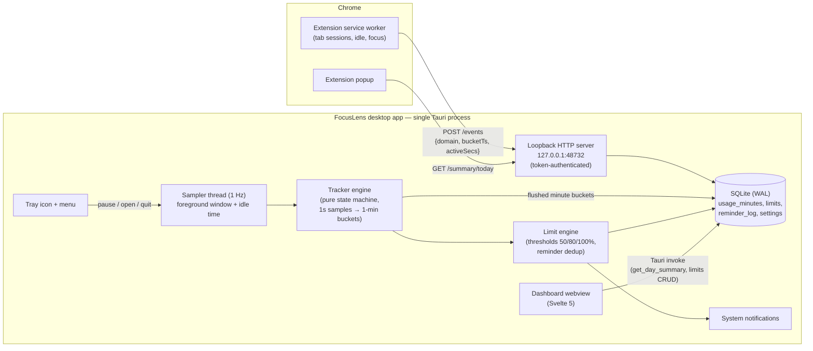

# FocusLens — Architecture (Phase 1)

## Components

**Sampler thread** polls once per second: foreground app (`active-win-pos-rs`) and seconds since
last user input (`user-idle`). Each sample is handed to the tracker engine. Pausable from the tray.

**Tracker engine** (`src-tauri/src/tracker/engine.rs`) is a pure state machine: it classifies each
second as active or idle (idle threshold default 60s, configurable), accumulates per
`(minute bucket, app)` and emits completed minute buckets for storage. No OS or DB access — fully
unit-tested.

**Loopback HTTP server** (`src-tauri/src/server/`) accepts minute-bucket domain events from the
browser extension. Bound to `127.0.0.1` only; every request must carry the pairing token
(generated on first run, shown in the dashboard Settings panel, pasted into the extension popup).
URLs never leave the machine — the extension sends hostnames only.

**Browser extension** is event-driven: `tabs.onActivated` / `tabs.onUpdated` /
`windows.onFocusChanged` / `idle.onStateChanged` delimit attribution spans; elapsed time is split
across minute buckets with second resolution. A 1-minute alarm flushes buckets to the agent;
unsent events buffer in `chrome.storage.local` (drop-oldest cap).

**Store** (`src-tauri/src/store/`) owns the SQLite connection: migrations, upsert-accumulate into
`usage_minutes`, day summaries, limits CRUD, reminder log, settings, and the daily retention sweep
(default 90 days).

**Limit engine** (`src-tauri/src/limits/`) runs after each minute flush: per enabled limit it
computes today's usage for the target (app/domain), determines newly crossed thresholds
(50/80/100%), dedupes against `reminder_log`, and fires a system notification.

**Dashboard** (Svelte) talks to the core only via typed Tauri `invoke` commands
(`src-tauri/src/commands.rs`): `get_day_summary`, `get_limits`, `upsert_limit`, `delete_limit`,
`get_pairing_token`, `set_tracking_paused`.

## Data flow for one tracked minute

1. Sampler reads (app="chrome.exe", idle=2s) once per second; extension independently attributes
   the same wall-clock seconds to "youtube.com".
2. At minute rollover the engine flushes `(bucket, app, active_secs, idle_secs)` rows
   (source=`desktop`, kind=`app`); the extension POSTs `(bucket, domain, active_secs)`
   (source=`extension`, kind=`domain`).
3. Store upserts both (accumulating on conflict).
4. Limit engine recomputes today's totals for limit targets and notifies on new threshold crossings.
5. Dashboard `get_day_summary` aggregates by app and by domain with source labels.

Desktop app-level rows for browsers and extension domain rows cover the same wall-clock time by
design; the dashboard presents apps and domains as separate labeled breakdowns rather than summing
them, so no double counting is shown.

## Phase 2/3 extension points

- `usage_minutes.kind` already admits `category`; `categories` + `category_rules` tables exist in
  the schema (unused in Phase 1).
- `limits.period` admits `weekly`; `limit_type` admits `hard`.
- The loopback server is the natural ingestion endpoint for the Phase 3 sync layer; `source`
  column distinguishes devices.
- The platform probe is a trait; Firefox/Edge reuse the same extension code (WebExtension APIs).
