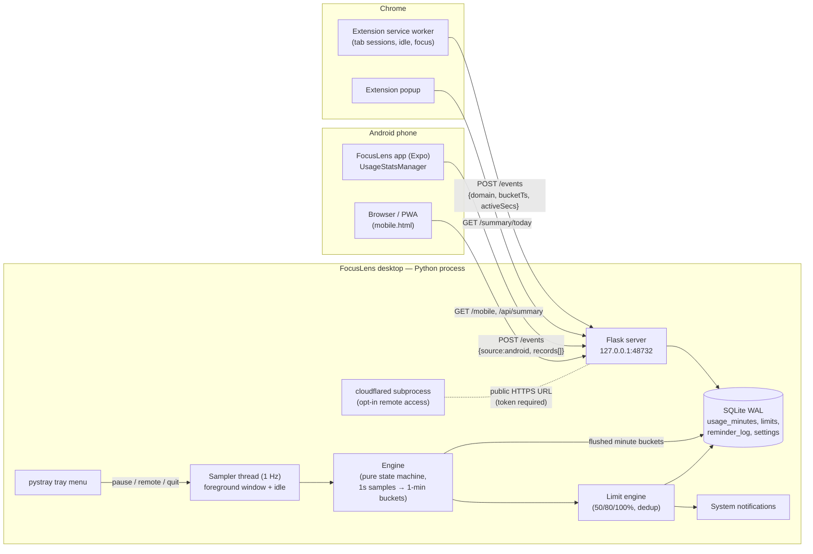

# FocusLens — Architecture

## Components

**Entry point** (`apps/desktop/run.py`) wires everything: Store, Flask thread,
Sampler thread, optional Tunnel, and the pystray menu on the main thread.

**Sampler thread** (`agent/sampler.py`) polls once per second via
`agent/probe.py` (Win32 `GetForegroundWindow`, `GetLastInputInfo`), hands each
sample to the engine, flushes completed buckets to the store, and runs the
hourly retention sweep. Pausable from the tray.

**Engine** (`agent/engine.py`) is a pure state machine: classify each second
active/idle (threshold default 60s), accumulate per `(minute bucket, app)`,
emit on rollover or app switch. No OS or DB access — fully unit-tested.

**Flask server** (`agent/server.py`) binds to `127.0.0.1:48732`. Serves the
dashboard HTML, the dashboard API (`/api/*`), and `/events` ingestion for the
extension and the Android app. Two trust levels: loopback requests are open;
requests carrying forwarding headers (arriving through the tunnel) must
present the pairing token on every non-public path.

**Store** (`agent/store.py`) owns the SQLite connection behind a thread lock:
schema, day summaries, limits CRUD, reminder log, settings, retention. Two
write paths: `upsert_usage` accumulates deltas (desktop, extension);
`replace_usage` overwrites snapshots (Android daily totals, midnight bucket).

**Limit engine** (`agent/limits.py`) runs after each flush: compute today's
total per enabled limit, find newly crossed thresholds (50/80/100%), dedupe
via `reminder_log`, notify via plyer.

**Tunnel** (`agent/tunnel.py`) launches a `cloudflared` quick tunnel as a
subprocess and parses the public `trycloudflare.com` URL from its output.
Off by default; toggled from the tray menu.

**Browser extension** (`apps/extension/`) is event-driven: `tabs.onActivated`
/ `windows.onFocusChanged` / `idle.onStateChanged` delimit attribution spans;
a 1-minute `chrome.alarms` flush POSTs buckets; unsent events buffer in
`chrome.storage.local` (drop-oldest cap). Sends hostnames only.

**Android app** (`apps/mobile/`) reads today's per-app foreground seconds via
`UsageStatsManager` (aggregate query, system apps filtered) and POSTs a
snapshot every ~15 min (`expo-background-fetch`) or on demand. Pairs by
scanning the dashboard QR (`focuslens://pair` deep link with host/token or
tunnel URL).

**Dashboard** (`dashboard/index.html`, `mobile.html`) — self-contained HTML
talking to `/api/*`. The QR modal has three modes: view over Wi-Fi, pair the
app, and remote view through the tunnel (URL carries the token once;
mobile.html persists it and sends it as a header thereafter).

## Data flow for one tracked minute

1. Sampler reads (app="chrome.exe", idle=2s) each second; the extension
   independently attributes the same wall-clock seconds to "youtube.com".
2. On rollover the engine flushes `(bucket, app, active, idle)` rows
   (source=`desktop`, kind=`app`); the extension POSTs
   `(bucket, domain, activeSecs)` (source=`extension`, kind=`domain`).
3. Store upserts both, accumulating on conflict. Android snapshots arrive on
   their own cadence and replace their midnight-bucket rows instead.
4. Limit engine recomputes totals for limit targets, notifies on new
   crossings.
5. Dashboard `/api/summary` aggregates by app and by domain with source
   labels. Desktop browser-app rows and extension domain rows cover the same
   wall-clock time by design; the dashboard shows them as separate labeled
   breakdowns, so no double counting is displayed.

## Extension points

- `usage_minutes.kind` already admits `category`; `categories` +
  `category_rules` tables exist in the schema (unused).
- `limits.period` admits `weekly`; `limit_type` admits `hard`.
- `/events` is the single ingestion door — any future device type adds a
  `source` value, picks accumulate-or-replace semantics, and lands in the
  same dashboard.
